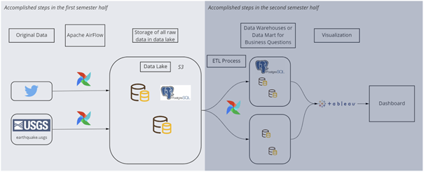

# DWL Earthquakes
## Contributors: Sandro Huber, Lea Senn, Thomas Schwendimann

### Structure
Jupyter Notebook: Contains the local prototypes to test our code. 

DAG: Contains the final code for the pipeline

docs: Contains project documentation

TODO: Finish readme once project advances

### Gitignore
Currently ignores the following:

.txt # tweets which were saved locally for testing purposes

.env # environment variables with credentials

.csv

.ipynb_checkpoints